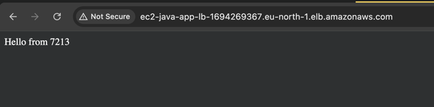

# AWS EC2 and Load Balancer

# Create 2 micro instances in AWS

## Simple Java application that returns a string

```java
@GetMapping("/")
public String home() {
    return "Hello from " + id;
}
```

## Create a docker image for the application

```dockerfile
FROM openjdk:17

# Set the working directory
WORKDIR /app

# Copy the JAR file into the container
COPY target/*.jar /app/myapp.jar

EXPOSE 8080

ENTRYPOINT ["java", "-jar", "/app/myapp.jar"]
```

## Build the docker image and push it to docker hub

```bash
docker build --platform linux/amd64 -t ec2-java-app:latest .
docker tag ec2-java-app:latest linnikoleh/ec2-java-app:latest
docker push linnikoleh/ec2-java-app:latest
```

## Configure ec2 instances

```bash
docker pull linnikoleh/ec2-java-app:latest
docker run -t --rm -p 8080:8080 --name ec2-java-app linnikoleh/ec2-java-app:latest
```


## Verify the application is running on the instances


# Setup application load balancer and assign instances to it

## Setup the load balancer


## Assign the instances to the load balancer


## Verify the load balancer is working



